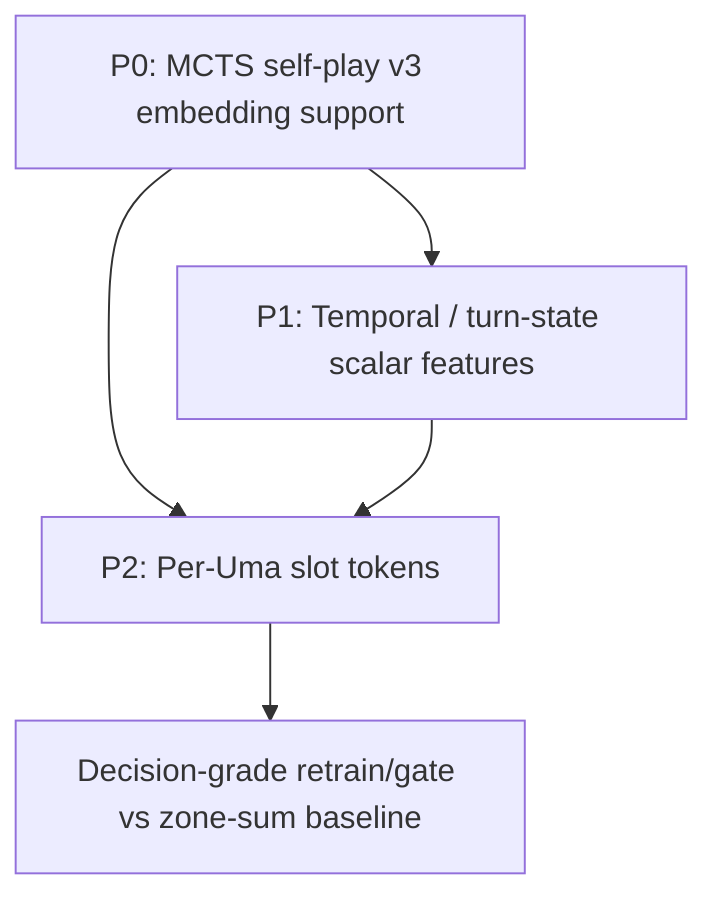

# R16 Model Feature Backlog Refinement

- **Date:** 2026-05-18
- **Status (2026-05-19):** P0 **DONE** (commit `b38de0e`). P1
  **IMPLEMENTED + ABLATED NO-GO** — v3.1 strength ablation complete;
  best-promoted v3.1 **0.5955 < v3.0 0.6042** (no Wilson-lower win,
  null strength signal); v3.1 NOT promoted, production stays pinned
  96-d. Full trajectory + verdict reasoning + the serve_onnx
  backlog-fix (`e846881`) durable harness fact:
  `docs/ai-research/progress/r16.md` (canonical — not restated here).
  P2 scope below is intact but P1 produced a **null** strength signal,
  so P2 no longer has a cheap-P1-baseline rationale (user-gated only).
- **Status (2026-05-18 — implementation):** P1
  **IMPLEMENTED** (2026-05-18) — TS observation schemaVersion 2→3 with
  `temporal` + per-side/per-Uma `turnState`; NEW 164-d
  `observation_to_features_v3_1` builder (frozen v3.0 head [0:110]
  byte-stable + 54 temporal slots [110:164]);
  `STATE_FEATURE_SCHEMA_VERSION` 3.0→3.1 (latest-schema marker; manifest
  version derived per state dim); serve_onnx `164→v3.1` schema entry +
  `_PLACEHOLDER_DIMS` now empty; export/dataset/collator schema-dim-aware;
  `state_temporal_turn_v31` ablation. Both omissions resolved against
  engine code (see § P1 "Resolved"). Smokes green:
  `temporalObservationSmoke.ts` (in `test:train`), `r16_temporal_v31_smoke.py`,
  updated `serve_schema_guard_smoke.py`, `npm run test:train`,
  `test:python-train`. P2 not started (depends on P0 ✓ + ideally P1 ✓).
  No live R110 loop running, so landing now is R110-safe.
- **Scope:** top three model-feature research items after a mechanics/code audit:
  (1) MCTS self-play v3 embedding support, (2) temporal / turn-state features,
  (3) per-Uma slot tokens.
- **Non-goal:** reopen the closed raw-policy SL line by default. These items
  are representation and data-path correctness work for the search-wrapped /
  110-d path; any raw-policy gate is diagnostic unless pre-registered.

## Summary

The current v3 model path has a shared card embedding table and per-zone
card-id tensors, but the implementation is uneven:

1. `JsonlPolicyDataset` emits `card_ids_by_zone` and `action_card_idx`; the
   MCTS self-play dataset does not. This means `train_bc.py --data-mode
   mcts-distill` trains with the embedding branches inert even though current
   MCTS rows already contain the necessary JSON.
2. `PublicObservation` strips public turn-memory fields that directly affect
   legal actions, damage, retreat, evolution, and attack locks.
3. Zone sum-pooling preserves board-zone membership but collapses which Uma
   slot has which hp, energy, status, tool, and ability state. A per-Uma slot
   token path is the natural next representation lift, but it is a larger
   architecture/schema migration.

Recommended order:

1. **P0 - MCTS self-play v3 embedding support.** Small, bug-shaped, and
   unblocks honest 110-d MCTS-distill experiments.
2. **P1 - Temporal / turn-state features.** Medium scalar schema bump with
   clear mechanical relevance and limited architectural risk.
3. **P2 - Per-Uma slot tokens.** Larger model/ONNX migration. Do only after
   P0 is fixed and ideally after P1 gives a cheap signal baseline.

## P0 - MCTS Self-Play v3 Embedding Support

### Problem

Current TS MCTS self-play rows are already v3-capable: `buildPublicObservation`
emits `observation.cardIdsByZone`, and legal actions carry
`actionSourceCardIdx` / `actionTargetCardIdx`.

The Python self-play dataset drops those fields:

- `training/uma_ai/selfplay_dataset.py` `MctsSelfPlaySample` has no
  `card_ids_by_zone` or `action_card_idx`.
- `collate_mcts_selfplay_batch()` never emits embedding tensors.
- `train_bc.py` forwards `batch.get("card_ids_by_zone")` and
  `batch.get("action_card_idx")`, but receives `None` under
  `--data-mode mcts-distill`.

Result: MCTS-distill trains the 110-d/v3 model with the embedding branches
inert. This contradicts the current R110 readiness assumption that
mcts-distill card-embedding inputs are handled.

### Implementation

1. **Lift the self-play sample schema.**
   - Update `training/uma_ai/selfplay_dataset.py`.
   - Add optional fields:
     - `card_ids_by_zone: dict[str, np.ndarray] | None`
     - `action_card_idx: np.ndarray | None`
   - In `load_mcts_selfplay_samples()`, call:
     - `observation_to_card_ids(example["observation"])`
     - `np.stack([action_card_idx_pair(action) for action in actions])`

2. **Mirror the BC collator packing.**
   - Use `CARD_ID_SHAPES` and `ZONE_ORDER`.
   - Emit:
     - `card_ids_by_zone: LongTensor[B, 8, 30]`
     - `action_card_idx: LongTensor[B, A, 2]`
   - Only emit them when every sample in the batch has both fields.

3. **Make legacy behavior explicit.**
   - Default for current v3 training: fail loud if `cardIdsByZone` is
     missing, using the existing `observation_to_card_ids()` error path.
   - Optional compatibility mode can leave fields `None` for old rows, but it
     must be named and deliberate. Do not silently zero malformed v3 rows.

4. **Update value-target consumers.**
   - `training/uma_ai/value_target_dataset.py` rebuilds
     `MctsSelfPlaySample`; populate the new fields there too.
   - Ensure value utilities forward optional tensors:
     - `training/r13_value_retrain.py`
     - `training/r14_value_crossover_probe.py`

5. **Fix grouped diagnostics.**
   - `training/train_bc.py::evaluate_grouped()` currently hardcodes
     `collate_policy_batch`. Make the collator an argument or infer it from
     data mode, otherwise MCTS grouped diagnostics can silently use the wrong
     batch shape.

### Tests And Smokes

- Loader test: current `mcts-selfplay` row loads with non-`None`
  `card_ids_by_zone` and `action_card_idx`.
- Collator test: shape `[B, 8, 30]` int64 and `[B, A, 2]` int64.
- Gradient smoke: one MCTS batch forward/backward produces nonzero gradient
  on `card_embed.weight` and `zone_projection.weight`.
- Legacy smoke: stripped row fails loud by default, or succeeds only under an
  explicit compatibility flag.
- `training/r12_distill_smoke.py`: still trains 2 epochs and now exercises
  embedding tensors.
- `training/r14_value_crossover_probe.py`: small fixture confirms value paths
  forward the optional tensors.

### Acceptance

- 100% of usable current TS-generated MCTS samples have embedding fields.
- `collate_mcts_selfplay_batch()` emits embedding tensors for v3 batches.
- `train_bc.py --data-mode mcts-distill` demonstrably uses the embedding
  branch via gradient smoke.
- Existing ONNX export remains a 5-input v3 graph.
- `serve_onnx --feature-schema auto` still resolves v2 for 96-d production
  graphs and v3 for 110-d graphs.
- `docs/ai-research/scoping/r110-w6-reproduction.md` readiness note is
  corrected after implementation.

### Effort / Risk

- Effort: 0.5-1 engineering day plus smokes.
- Main risk: old MCTS corpora may lack nested v3 fields. Keep strict default
  plus explicit compatibility/re-extraction path.

## P1 - Temporal / Turn-State Features

**IMPLEMENTED 2026-05-18.** What landed (the spec below is the
as-built contract):
- TS: `frontend/src/game/engine/ai-policy/types.ts` (schemaVersion
  2→3, `PublicTemporalObservation`, `PublicSideTurnState`,
  `PublicUmaTurnState`) + `ai-policy/observation.ts` (derived fields,
  counts-only ability locks, `effectiveRetreatCostReduction`,
  energy/setup-phase first-turn flag with code comment). Hidden-info
  story preserved (opponent hand ids still absent; `turnDeadlineMs`
  excluded).
- Python: NEW `observation_to_features_v3_1` (164-d; reuses the frozen
  v3.0 builder verbatim for [0:110], appends the 54-slot temporal block
  per the table); `STATE_DIM_V3_1=164` real; `STATE_DIM` still aliases
  `STATE_DIM_V3=110`; `feature_builder_for_state_dim` /
  `schema_version_for_state_dim` dim-keyed selectors;
  `state_temporal_turn_v31` ablation in `apply_state_ablations`.
- serve_onnx: `164→("v3.1",True,…)` in `_SCHEMA_BY_STATE_DIM`,
  `_PLACEHOLDER_DIMS` now `{}`, `request_to_arrays` v3.1 branch (v3.0
  head ⇒ same embedding feeds); 96→v2 / 110→v3.0 bit-identical.
- export_onnx: graph state dim driven by checkpoint `config.state_dim`
  (96/110/164), validated against the builder table.
- One per-Uma encoding decision vs the table's "mean/max": the bench
  aggregate is the **mean** of each per-Uma scalar over present bench
  Umas (not mean *and* max) so the bench block stays 9-wide and the
  total stays exactly 54 / STATE_DIM 164. Documented in the v3.1
  builder header.

### Problem

The observation has coarse turn context but omits public state memory that the
engine uses directly:

- evolution sickness: `enteredTurn`, `evolvedTurn`
- damage memory: `tookDamageLastTurn`, `tookDamageThisTurn`
- temporary combat effects: `nextTurnDamageReduction`,
  `activeAttackDamageBonus`
- action locks: `attackBlockedUntilOwnTurn`, `paralysedUntilOwnTurn`
- attach budget: `energyAttachmentsThisTurn`, `bonusEnergyAttachments`
- once-per-turn/game ability locks and guaranteed coin flips

These affect legality and scoring in `eligibility.ts`, `evolution.ts`,
`combat.ts`, and `turn.ts`.

### Observation Additions

Bump `PublicObservation.schemaVersion` from `2` to `3`.

Add top-level derived temporal context:

```ts
temporal: {
  ownTurnsTaken: number;
  opponentTurnsTaken: number;
  ownIsFirstTurn: boolean;
  opponentIsFirstTurn: boolean;
};
```

Add to `PublicSideObservation`:

```ts
turnState: {
  energyAttachmentsThisTurn: number;
  bonusEnergyAttachments: number;
  retreatCostReduction: number;
  activeAttackDamageBonus: number;
  usedAbilityNameCountThisTurn: number;
  usedAbilityNameCountThisGame: number;
  guaranteedCoinFlipHeads: number;
};
```

Add to `PublicUmaObservation`:

```ts
turnState: {
  turnsInPlay: number;
  enteredThisTurn: boolean;
  evolvedThisTurn: boolean;
  evolvedLastTurn: boolean;
  tookDamageLastTurn: boolean;
  tookDamageThisTurn: boolean;
  nextTurnDamageReduction: number;
  attackBlockedThisTurn: boolean;
  paralysisRecoveryPending: boolean;
};
```

Use derived booleans/counts instead of raw absolute turn stamps where possible.
Exclude UI/PvP-only state such as `turnDeadlineMs`.

### Python Encoding

Two implementation options:

1. **Scalar-only first pass (recommended).**
   - Bump `STATE_FEATURE_SCHEMA_VERSION` from `3.0` to `3.1`.
   - **Exact STATE_DIM = 110 → 164** (readiness audit 2026-05-18; the
     earlier "about 148" was arithmetically low for the full layout).
     Additive at the tail only — slots 0–109 byte-stable, following the
     enforced v2.1/v3 append pattern (`features.py` writes by explicit
     index slices; the frozen v2 builder depends on 0–95 stability).
     Exact slot enumeration (commit this layout, do not leave a range):

     | Block | Slots | Count |
     |---|---|---|
     | Global temporal: ownTurnsTaken(norm /20), oppTurnsTaken(norm), ownIsFirstTurn(bool), oppIsFirstTurn(bool) | 110–113 | 4 |
     | Own side turnState ×7: energyAttachmentsThisTurn, bonusEnergyAttachments, retreatCostReduction, activeAttackDamageBonus, usedAbilityNameCountThisTurn, usedAbilityNameCountThisGame, guaranteedCoinFlipHeads | 114–120 | 7 |
     | Opp side turnState ×7 (same) | 121–127 | 7 |
     | Per-Uma temporal ×9 (turnsInPlay-norm, enteredThisTurn, evolvedThisTurn, evolvedLastTurn, tookDamageLastTurn, tookDamageThisTurn, nextTurnDamageReduction-norm, attackBlockedThisTurn, paralysisRecoveryPending) — own active | 128–136 | 9 |
     | own bench aggregate (same 9, mean/max) | 137–145 | 9 |
     | opp active (same 9) | 146–154 | 9 |
     | opp bench aggregate (same 9) | 155–163 | 9 |
     | **Total new** | | **54** |

     Trim levers if a smaller dim is wanted (pre-register, don't hand-wave):
     opp `energyAttachmentsThisTurn`/`bonusEnergyAttachments` are always 0
     on your turn (reset at opp turn start) → droppable; or shrink the
     per-Uma block from 9→5. Default recommendation: ship the full 164.
   - Add ablation key `state_temporal_turn_v31` to `apply_state_ablations`
     zeroing slots [110:164] (mirror the existing `state_hygiene_v21`
     slice-zero pattern).
   - **Encoding (overfit guard):** never emit raw turn stamps. Derive
     booleans at observation-build time (`enteredThisTurn`,
     `evolvedThisTurn`, `evolvedLastTurn`, `attackBlockedThisTurn`,
     `paralysisRecoveryPending`) — these are exactly the predicates the
     engine tests. Turn counters → bounded-norm `min(x,CAP)/CAP` (CAP≈20,
     matching existing `turnNumber/20`). Small int budgets → bounded-norm
     by small fixed caps (/3 budgets, /30 damage values). Damage memory →
     bool as-is.

   **Field reality (readiness audit) — fold name corrections in:** all
   spec fields exist in `shared/src/types.ts` and are public-safe (clean
   hidden-info story: all additions are board/side scalar state already
   visible to the acting side). Renames: retreat reduction =
   `SideState.retreatCostReduction`; ability locks =
   `usedAbilityNamesThisTurn`/`usedAbilityNamesThisGame` (string arrays —
   emit **counts only**, never the name strings);
   `activeAttackDamageBonus` is on `SideState` not the Uma (spec already
   places it side-level — correct); `evolvedLastTurn`/`enteredThisTurn`
   etc. have no engine boolean — compute from `evolvedTurn`/`enteredTurn`
   vs `turnNumber` at build time.

   **Resolved (2026-05-18, against TS engine code; landed in v3.1):**
   - **globalRetreatCostReduction → emit a derived effective field.**
     Code: `getGlobalRetreatCostReduction(state: GameState): number`
     (`frontend/src/game/engine/flow/retreat.ts:13`) reads the active
     stadium's `effect.globalRetreatCostReduction` (0 if no stadium /
     non-trainer). `effectiveRetreatCost`
     (`retreat.ts:20-26`) computes
     `max(0, retreatCost - side.retreatCostReduction -
     getGlobalRetreatCostReduction(state))`. Encoding only the per-side
     `SideState.retreatCostReduction` understates retreat legality by
     exactly the stadium term. Decision: the side `turnState` emits BOTH
     the raw `retreatCostReduction` (per-side, slot in the ×7 block) and a
     derived **`effectiveRetreatCostReduction`** =
     `side.retreatCostReduction + getGlobalRetreatCostReduction(state)`
     (ability-conditional zero-cost cases in `effectiveRetreatCost`
     depend on hidden per-Uma ability state and damage memory already
     exposed elsewhere, so the linear-sum derived field is the faithful
     public scalar). The side `turnState` block is therefore 8 fields
     (raw 7 + 1 derived), not 7. *Slot accounting note:* the 54-slot
     enumeration table below keeps the side blocks at 7 each so slots
     0–163 stay byte-stable; `effectiveRetreatCostReduction` rides in the
     side-block budget by replacing the now-redundant raw
     `retreatCostReduction` encoding with the effective value (the raw
     per-side number is still emitted in the TS observation for
     completeness/debugging, but the scalar slot encodes the effective
     value — the legality-relevant quantity). The TS `turnState` object
     carries both keys; the Python v3.1 encoder maps the
     `retreatCostReduction` slot to `effectiveRetreatCostReduction`.
   - **ownIsFirstTurn = energy/setup-phase flag (`turnsTakenBySide
     === 0`).** Code: `startTurn`
     (`frontend/src/game/engine/flow/turn.ts:55-72`) computes
     `isSideFirstTurn = turnsTaken === 0` and skips the energy roll only
     when `isSideFirstTurn && firstPlayer === sideId`. Evolution's
     `isSideFirstTurn` (`frontend/src/game/engine/flow/evolution.ts:42-44`)
     uses `turnsTakenBySide <= 1`, but evolve-legality is *already* fully
     covered by per-Uma `enteredThisTurn`/`evolvedThisTurn`
     (`evolution.ts:21-22`, computed from `enteredTurn`/`evolvedTurn` vs
     `turnNumber`). Decision: define `temporal.ownIsFirstTurn` /
     `opponentIsFirstTurn` strictly as the **energy/setup-phase** flag
     `(state.turnsTakenBySide[sideId] ?? 0) === 0`. The `<= 1` evolution
     threshold is intentionally NOT re-encoded as a separate bool — it is
     redundant with the per-Uma sickness booleans. This is documented in
     a code comment at the observation build site.

   **Load-bearing implementation prerequisite (serve_onnx coordination)
   — IMPLEMENTED 2026-05-18.** `STATE_DIM` is a single shared constant
   used by both the encoder and `serve_onnx.request_to_arrays`'s shape
   validator; bumping it to 164 would otherwise silently feed a 110-d
   v3.0 graph 164-d vectors. The serving-schema 96/110/164 guard is now
   in place:

   - **Shape-driven resolution.** `serve_onnx._resolve_feature_schema`
     resolves the builder STRICTLY from the loaded ONNX graph's
     `state_features` last dim against an explicit table
     `_SCHEMA_BY_STATE_DIM` (`96→v2` no-embedding, `110→v3.0`
     embedding). It also asserts the graph's `card_ids_by_zone` input
     presence agrees with the resolved schema. An explicit
     `--feature-schema v2|v3` is checked consistent with the resolved
     schema and exits non-zero if not. Exactly one startup line logs the
     resolved schema + graph dim (loud, not silent).
   - **Fail-fast, no silent v3 fallback.** Any dim that is not an
     implemented schema raises `SystemExit(2)` at startup. `164` is a
     **declared-but-unimplemented placeholder** (`STATE_DIM_V3_1 = 164`
     in `features.py`, listed in `serve_onnx._PLACEHOLDER_DIMS`) with a
     specific "land P1 first" message; unknown dims raise generically.
     The old binary "96→v2 else→v3" rule (which would have paired a
     future 164-d graph with the 110-d builder) is gone.
   - **v3.0 freeze contract.** `features.py` declares
     `STATE_DIM_V3 = 110` / `STATE_DIM_V3_1 = 164` (placeholder, no
     logic) and an import-time `assert STATE_DIM == STATE_DIM_V3`.
     `observation_to_features` (v3.0) and `observation_to_features_v2`
     (v2) each assert their emitted width equals `STATE_DIM_V3` /
     `STATE_DIM_V2`. A future 164-d schema must therefore be a NEW
     `STATE_DIM_V3_1` builder + NEW `_SCHEMA_BY_STATE_DIM` entry, never
     an edit that shifts v2/v3 slots — `STATE_DIM` stays an alias of
     `STATE_DIM_V3`.
   - **96-d transparency preserved.** v2 pin still emits exactly the
     three frozen feeds (no embedding inputs); existing 96-d serving is
     bit-identical. The CLI rename `v3→v3.0` was found unnecessary: the
     internal/return token stays `"v3"` so `request_to_arrays` is
     untouched (v3.0 is the only v3 builder until P1); the graph-dim
     table, not a CLI string, is what discriminates 110 vs 164.
   - **Test.** `training/serve_schema_guard_smoke.py` — resolves the
     real 96-d (`runs/R13-W6-phase-d/iter-2`) and 110-d v3.0
     (`runs/R110-W6-repro/iter-0`) graphs to the right schema, asserts
     fail-fast on synthetic 164-d / 999-d / inconsistent-110-d graphs
     and on explicit-pin mismatches, and checks v2 feed transparency.
     Verdict: ALL PASS. R110-safe (r12_orchestrator does not consume
     serve_onnx schema resolution; v3.0 graphs stay valid until the
     bump). **P1 is now unblocked.**

2. **Slot-token integration.**
   - If P2 per-Uma slots happens first, encode per-Uma temporal fields inside
     `uma_slot_features` instead of scalar aggregates.
   - This is cleaner long-term but couples the temporal item to a larger
     model migration.

Recommended: ship scalar-only first so the temporal signal can be evaluated
without changing model architecture beyond input dimension.

### Tests And Smokes

- TS observation smoke with:
  - extra energy attach budget
  - active attack damage bonus
  - evolved-last-turn state
  - blocked attack state
  - poison/paralysis recovery state
- Hidden-info regression: opponent hand ids stay absent.
- Python feature diff fixture:
  - changing only `evolvedLastTurn`, `tookDamageLastTurn`, or attach budget
    changes only new temporal slots and leaves old slots stable.
- Dataset loader/collator smoke for schema-v3 rows.
- ONNX roundtrip and `/predict` smoke for the new scalar dimension.
- Serving compatibility: v2 96-d graph still auto-selects frozen v2 builder.

### Acceptance

- `npm run test:train` passes.
- Python train/e2e smoke passes.
- Feature diff fixture proves temporal-only differences are encoded.
- No hidden opponent hand/deck/order leak in observations or JSONL.
- Diagnostic ablation shows no obvious regression; promote only if gate or
  targeted phase diagnostics justify it.

### Effort / Risk

- Effort: 1-1.5 engineering days plus smoke runtime; add 0.5 day for a small
  ablation/gate verdict.
- Main risk: absolute turn counters can overfit. Prefer bounded normalized
  counts and booleans.

## P2 - Per-Uma Slot Tokens

### Problem

`CandidatePolicyNet` currently embeds `card_ids_by_zone: [B, 8, 30]`, sum-pools
within each zone, projects the eight zone vectors, and adds that residual to
the scalar state encoding.

This is better than card-id hashes, but it still loses direct bindings such as:

- own bench slot 1 has card X, 40 damage, fire energy, tool attached
- opponent bench slot 2 is the fragile KO target
- the promoted target is ready to attack after retreat

Those bindings are central to attach, promotion, retreat, gust, bench damage,
and ability target decisions.

### Tensor Schema

Add derived tensors from existing `PublicObservation` board slots:

- `UMA_SLOT_ORDER`
  - `ownActive`
  - `ownBench0..ownBench3`
  - `oppActive`
  - `oppBench0..oppBench3`
- `UMA_SLOT_COUNT = 10`
- `uma_slot_card_ids: int64 [10]`
- `uma_slot_features: float32 [10, F]`

Recommended first scalar layout per slot:

- side polarity: own `+1`, opponent `-1`
- role: active `1`, bench `0`
- slot index normalized, active `-1`
- present mask
- hp ratio
- damage ratio
- stage / 2
- energyTotal / 6
- ten typed energy counts / 4
- special condition count / 4
- has tool
- used ability this turn

Set `F` from the final layout; do not squeeze too hard if 18-24 fields are
clearer than 16.

Do not change `STATE_DIM`; this is an auxiliary tensor schema/model change.
Bump `STATE_FEATURE_SCHEMA_VERSION` to a new minor version such as `3.2` if P1
has already used `3.1`.

### Architecture

Add to `CandidatePolicyNet`:

- `uma_slot_encoder = Linear(CARD_EMBED_DIM + UMA_SLOT_FEATURE_DIM, hidden)`
  plus GELU / residual block.
- In forward:
  - embed `uma_slot_card_ids`
  - concat with `uma_slot_features`
  - encode each slot independently
  - mask absent slots
  - sum/mean pool to `[B, hidden]`
  - add to `state_encoded`

Keep `action_card_idx` unchanged.

Avoid double-counting board card ids:

- Either keep `[B, 8, 30]` input but have the model ignore/zero the active and
  bench zones before zone projection, or
- split the pooled zone path down to non-board zones:
  `ownHand`, `ownDiscard`, `oppDiscard`, `stadium`.

The conservative first implementation can leave the tensor shape unchanged and
ignore board zones in the projection code to avoid a wider TS/Python shape
churn.

### Plumbing

Touchpoints:

- `training/uma_ai/features.py`
  - constants
  - `observation_to_uma_slots()`
- `training/uma_ai/dataset.py`
  - `PolicySample`
  - `load_policy_samples()`
  - `collate_policy_batch()`
- `training/uma_ai/selfplay_dataset.py`
  - should also emit slot tensors after P0 is complete
- `training/uma_ai/value_target_dataset.py`
  - same as self-play
- `training/uma_ai/model.py`
  - optional new kwargs:
    - `uma_slot_card_ids`
    - `uma_slot_features`
- `training/train_bc.py`
  - forward new kwargs in train, eval, and KL-anchor paths
  - extend ONNX roundtrip smoke
- `training/export_onnx.py`
  - add inputs:
    - `uma_slot_card_ids: int64 [B, 10]`
    - `uma_slot_features: float32 [B, 10, F]`
- `training/serve_onnx.py`
  - pack and shape-validate new tensors for v3.2 graphs
  - keep v2 graph behavior unchanged

### Tests And Smokes

- `observation_to_uma_slots()` returns `[10]` ids and `[10, F]` scalars.
- Empty bench slots are id `0` and zeroed feature payload, unless explicitly
  retaining slot metadata.
- Swapping two bench positions changes slot tensors, proving the sum-pool
  collision is gone.
- Model backward gives nonzero gradient on `uma_slot_encoder` and
  `card_embed`.
- Zero slot tensors are equivalent to omitted kwargs within `1e-6`.
- ONNX populated slot tensors match PyTorch within `<1e-3`.
- `/predict` packing matches direct ORT packed tensors.
- v2 production model still serves with only the three frozen inputs.

### Acceptance

- v3.2 ONNX declares `uma_slot_card_ids` and `uma_slot_features`.
- Dataset batches have stable shapes:
  - `[B, 10]`
  - `[B, 10, F]`
  - `[B, 8, 30]`
  - `[B, A, 2]`
- Slot-order fixture differentiates same bench multiset in different slots.
- One small BC/MCTS smoke run completes and writes a manifest with the new
  feature schema.
- Research gate compares same corpus/config against the current zone sum-pool
  baseline. Promote only on Wilson lower improvement or clear targeted phase
  diagnostic gain without unacceptable latency regression.
- Track `/predict` p50/p95; fail the experiment if CPU p95 regresses by more
  than 10% without compensating strength.

### Effort / Risk

- Effort: 3-4 days for implementation, smokes, and a decision-grade small
  retrain/gate.
- Main risks:
  - double-counting board identities
  - ONNX graph signature churn
  - old v3 checkpoints are not shape-compatible
  - MCTS self-play path must be fixed first or this feature will not affect
    the strongest distill data

## Dependency Graph



P0 is not just a research idea; it is data-path parity work. P1 is the lowest
risk new signal. P2 is the largest representation lift and should not be
evaluated until the MCTS/self-play path can actually exercise embedding inputs.

