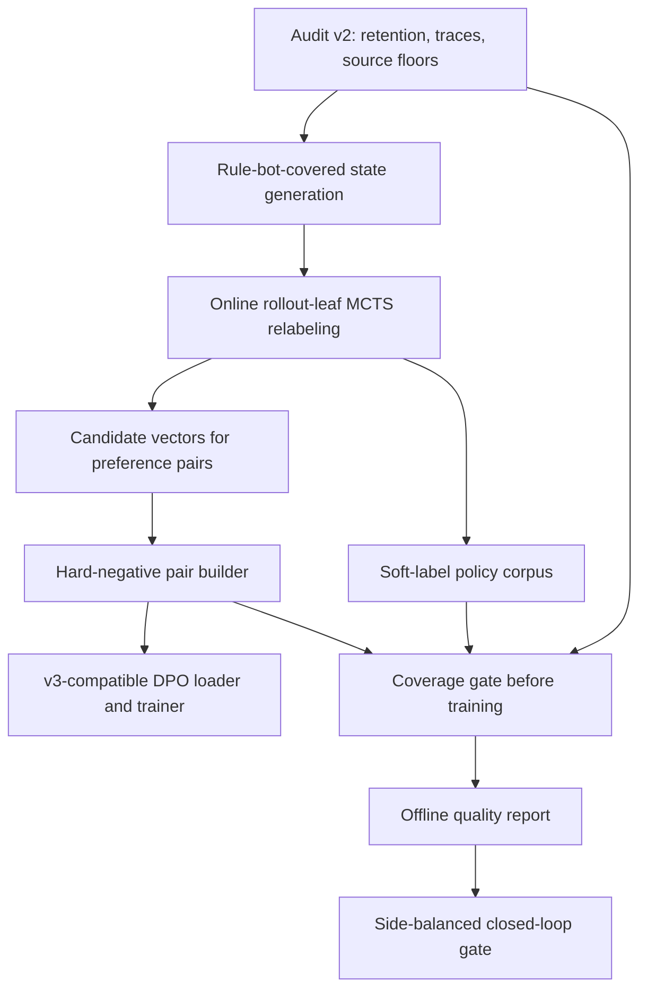

# R16 Training Data Backlog Refinement

- **Date:** 2026-05-18
- **Status (2026-05-21):** SUPERSEDED — Fork A contested-coverage pilot
  DONE-FALSIFIED at chunk 5j n=1000 confirmation gate (monotonicity
  broken, margin sign-flipped −1.8pp); P1 rule-bot-covered MCTS relabel
  3a/3b emit-path landed and chunks 5a–5i exhausted the corpus signal
  (DONE-NEGATIVE). Canonical outcome: `docs/ai-research/progress/r16.md`
  §§ "Contested-Coverage Pilot" + "Online MCTS Relabel Infra (3a)".
  The P0/P1/P2 prose below remains the canonical recipe and design
  reference for any future revisit but is not on the active queue.
- **Scope:** deeper backlog refinement for the top three training-data research
  ideas after mechanics, data-loader, simulator, and subagent review.
- **Top three items:**
  1. Corpus retention and state-coverage audit v2.
  2. Rule-bot-covered contested states relabeled by rollout-leaf MCTS.
  3. Hard-negative preference pairs from outcome and MCTS candidate vectors.
- **Non-goal:** create more generic self-play rows, relax the training loader
  to keep forced `legalActions.length < 2` states, or revisit model capacity.
  The bottleneck is contested-state coverage, not raw row volume
  (`docs/ai-research/analysis/training-data-coverage-audit.md`); the capacity
  axis is formally closed (see the closed-axes / Do-not list in
  `docs/ai-research-backlog.md`).

## Summary

The current best training-data path is sequential:

1. **P0 - Audit v2.** Promote the existing one-corpus coverage audit into a
   reusable, trace-aware command that can compare raw exports, actual retained
   loader rows, gate/eval traces, manifests, and per-slice loss.
2. **P1 - Rule-bot-covered MCTS relabeling.** Generate deployment-relevant
   contested states from rule-bot-covered trajectories, then label the exact
   in-memory states with rollout-leaf MCTS while the full `GameState` is still
   available.
3. **P2 - Hard-negative preference pairs.** Expand DPO/preference data from
   one best-vs-runner-up pair into filtered top-K, rule-bot-negative, and
   high-prior trap pairs, preferably using the P1 corpus as the state source.

The main dependency is that old gate artifacts do not persist exact decision
states. Any serious coverage comparison or MCTS relabeling needs new traces or
online labels emitted during simulation.

## Fork A — Contested-State Data Coverage (actionable backlog item)

Fork A is the single backlog item that *moves the coverage metric*; P0/P1/P2
above are its tooling, label-source, and ranking sub-tasks. This section is the
canonical statement of the item — it cites evidence by path, it does not
restate the audit table or the R6 capacity result.

### Objective

Raise the audit's existing **contested-state coverage** metric:

> `legal_action_count`: fraction of *retained* (>=2-legal) decision rows that
> are contested with **>=4 legal actions** — floor **>=30%**.

This is the metric already defined at the bottom of
`docs/ai-research/analysis/training-data-coverage-audit.md` (proposed
source-mix target, `legal_action_count` row). Do not invent a new metric. The
R7 retained corpus sits below this floor (it is dominated by exactly-2-legal
binary choices per that audit); the goal is to move it above 30% **without**
adding raw rows or model parameters.

The end-to-end success signal is whether moving this coverage metric, at fixed
raw volume and fixed capacity, moves the strength metric the repo already
gates on: the side-balanced gate win rate / Wilson lower bound from
`backend/src/sim/evaluateModelVsHeuristic.ts` (rule-bot opponent,
side-balanced, the same gate the audit references).

### Candidate mechanisms (options to test, not a chosen solution)

All three keep raw retained-row volume fixed; they differ only in *where the
contested states come from*:

1. **Contested-state filtering / oversampling of already-generated rows.**
   Re-mix the existing retained corpus so >=4-legal rows are upsampled and
   2-legal rows downsampled to hold total retained count fixed. Cheapest;
   tests whether coverage alone moves strength with no new generation. Risk:
   may exhaust the existing >=4-legal population and just duplicate rows.
2. **Targeted generation biased toward high-legal-action decision states.**
   Bias the rule-bot-covered state generator (P1) to spend its game/seed
   budget where branch factor is high, then keep only enough rows to match
   the baseline retained count. Tests whether *fresh* contested states beat
   reweighting the same ones.
3. **Replay-buffer / loss weighting toward contested rows.**
   Leave the corpus unchanged but weight the policy loss by legal-action
   count (or a contested indicator). Tests the coverage hypothesis as an
   optimization-weighting question, fully decoupled from data generation.

P0 (Audit v2) is the measurement instrument for all three; P1 supplies the
state source for option 2; option 1 and option 3 need no new corpus.

### Cheap experiment design

Pre-registered, single-variable, no expensive gate until the floor is met:

- **Hold fixed:** model architecture/capacity (closed axis — see
  `docs/ai-research-backlog.md` closed-axes list); total retained training-row
  count (raw-volume axis — see
  `docs/ai-research/analysis/training-data-coverage-audit.md`); optimizer,
  schema, and seed discipline.
- **Vary (one knob):** contested-state coverage via exactly one mechanism
  above per run, sweeping the metric across roughly `{baseline, ~30%, ~45%}`.
- **Generate:** for option 2 only, the P1 pilot budget already specified (50
  games per source, `modelSide=both`) but biased toward high-branch states;
  for options 1 and 3, nothing new is generated.
- **Measure:** Audit v2 reports the `legal_action_count` contested fraction
  (confirm the knob actually moved it); then train and run the existing
  side-balanced gate.
- **Success criterion:** at fixed raw volume and fixed capacity, increasing
  the contested fraction toward/over the 30% floor produces a monotone,
  side-balanced improvement in gate Wilson-lower over the coverage-matched
  baseline. A flat or negative strength response at higher coverage
  *falsifies* the contested-coverage bottleneck and reopens the data
  question; it does not reopen capacity or raw volume.
- **Stop rule:** no n>=1000 / expensive closed-loop gate until the audit
  shows the trained corpus clears the >=30% contested floor and the cheap
  sweep shows a positive coverage→strength slope.

### Non-goals (reaffirmed)

- No capacity / architecture tuning — formally closed
  (`docs/ai-research-backlog.md` closed-axes list; R6 controlled
  2x-capacity experiment is the cited evidence there).
- No generic raw-volume increase and no relaxing `min_actions` to 1 —
  single-action states carry zero policy gradient
  (`docs/ai-research/analysis/training-data-coverage-audit.md`).
- No MCTS self-play as the primary state distribution (mcts-distill v1
  failed on exactly that mistake; recorded in the audit doc).

## Current Ground Truth

Existing coverage audit:

- Tool: `training/data_coverage_audit.py`
- Report: `docs/ai-research/analysis/training-data-coverage-audit.md`
- Corpus audited: `runs/R7-multi-teacher-warmstart/iter-000/mixed.jsonl`
- Result: `12387` rows, `3789` retained, `8598` dropped.
- Retention rate: `30.6%`
- Drop cause: `100%` `lt_min_actions(<2_legal)`.

Existing loader behavior:

- `training/uma_ai/dataset.py` silently drops policy rows with fewer than the
  configured minimum legal actions or invalid selected indices.
- Schema, card-id, and feature failures are raise-class failures, not silent
  retention losses.
- Current DPO data path in `training/pair_corpus.py` emits one pair per
  eligible outcome row: best candidate vs runner-up.

Existing simulator trace behavior:

- `backend/src/sim/evaluateModelVsHeuristic.ts` can emit decision traces with
  public observation, legal actions, selected action, heuristic action, fallback
  state, result, and optional teacher output.
- Current trace rows do not include full `GameState`.
- `backend/src/sim/dagger/relabelDecisionTrace.ts` can consume precomputed
  trace teachers, but it cannot run MCTS offline from a trace row because MCTS
  needs the live `GameState`.

## Backlog Order

| Priority | Item | Why First | Main Output |
|---|---|---|---|
| P0 | Audit v2 | Defines measurable coverage, retention, and trace gaps before spending compute | Generalized JSON/markdown audit and source-mix gates |
| P1 | Rule-bot-covered MCTS relabeling | Produces the contested deployment-distribution rows the audit says are missing | Soft policy-target JSONL with MCTS diagnostics |
| P2 | Hard-negative pairs | Extracts richer ranking signal once candidate vectors and state distribution are trustworthy | Pair JSONL, pair manifest, v3-compatible DPO loader/trainer path |

## P0 - Corpus Retention And State-Coverage Audit v2

### Problem

The current audit answered one important question for R7: most discarded rows
were forced decisions, not malformed examples. It is not yet a reusable
audit framework for arbitrary corpora, MCTS distillation rows, value-target
rows, outcome rows, gate traces, and training diagnostics.

The key missing capability is exact train-vs-gate overlap. Old eval manifests
generally do not persist per-decision traces, so the current report can only
use structural proxies for gate coverage.

### Scope

Promote `training/data_coverage_audit.py` into a generalized report command
that can answer:

- Which rows are retained by the actual loader for each data mode?
- Which rows are silently dropped, and why?
- Which schema/card-id/feature failures would raise?
- Which phases, action kinds, turn buckets, side buckets, branch factors, and
  source tags are missing or overrepresented?
- When decision traces exist, which gate/eval state buckets are unseen in
  training?
- Which source-mix floors should block the next corpus from training?

### Implementation Plan

1. Generalize CLI inputs.
   - Add `--corpus`, `--data-mode`, `--train-manifest`, `--export-manifest`,
     `--gate-manifest`, `--decision-trace`, `--baseline-report`, `--out-json`,
     and `--out-md`.
   - Support multiple corpora/manifests in one report.
   - Keep the existing R7 defaults reproducible.

2. Add loader-mode retention checks.
   - Policy rows: `JsonlPolicyDataset` / `load_policy_samples`.
   - MCTS distill rows: `MctsSelfPlayDataset` / `load_mcts_selfplay_samples`.
   - Value rows: `ValueTargetDataset`.
   - Keep a fast predicate mode for cheap audits, but add `--loader-check` for
     ground-truth retention.

3. Normalize row and trace buckets.
   - Reuse and extend the current `_slice_values`, `_turn_bucket`,
     `_count_bucket`, `_action_kind`, and `_energy_bucket` logic.
   - Support policy rows, outcome rows, MCTS self-play rows, value-target rows,
     and decision trace rows.

4. Add trace-aware overlap.
   - Consume `--decision-trace` files from `evaluateModelVsHeuristic.ts`.
   - Report exact overlap when traces exist.
   - Emit an explicit environment gap when only manifests exist.
   - Optionally add `stateFingerprint` later if full-state trace snapshots are
     introduced.

5. Emit enforceable source-mix recommendations.
   - Keep the existing "do not relax `min_actions` to 1" guardrail.
   - Report floor/cap violations for side, source, phase, action kind, turn
     bucket, and legal-action-count buckets.

### Proposed Report Schema

```json
{
  "schemaVersion": 2,
  "inputs": {
    "corpora": [],
    "trainManifests": [],
    "gateManifests": [],
    "decisionTraces": []
  },
  "retention": {
    "byCorpus": {},
    "dropReasonCounts": {},
    "raiseReasonCounts": {},
    "retainedFraction": 0.0
  },
  "coverage": {
    "slices": {},
    "trainVsGate": {},
    "coverageVsLoss": {}
  },
  "recommendations": {
    "sourceMixTargets": [],
    "sliceFloors": [],
    "doNot": []
  },
  "environmentGaps": []
}
```

### Acceptance Criteria

- One command audits at least policy, MCTS-distill, and value-target rows.
- The R7 headline remains reproducible: `3789 / 12387` retained and all drops
  due to `<2` legal actions.
- Retention accounting closes: retained plus silent drops plus raise-class
  failures equals total parsed rows.
- Exact train-vs-gate overlap is reported when traces exist.
- Trace absence is called out as an environment gap when exact overlap cannot
  be computed.
- JSON and markdown reports contain the same headline counts.
- The report rejects a corpus that misses pre-registered contested-state slice
  floors.

### Tests

- Extend `training/data_coverage_audit_smoke.py`.
- Add synthetic fixtures for:
  - policy rows with forced-action drops and invalid selected indices;
  - MCTS rows with bad `visitDistribution` lengths and zero visit mass;
  - value rows missing `rootValue`;
  - decision traces with and without exact overlap;
  - manifest-only fallback.
- Keep `npm run test:data-coverage-audit`.

### Effort

Estimated `4-5.5` engineering days:

- Generalized report schema and inputs: `1.5-2` days.
- Loader-mode retention and row normalizer: `1` day.
- Trace-aware overlap and metrics: `1-1.5` days.
- Fixtures, smoke tests, and docs: `0.5-1` day.

## P1 - Rule-Bot-Covered States Relabeled By Rollout-Leaf MCTS

### Problem

The best next rows should come from states the production system actually
visits, not from self-play-only distributions. The audit shows that forced
decisions dominate discarded rows, and old gate artifacts do not contain exact
decision states.

Cost basis (corrected, 2026-05-18 sizing pass). The earlier
"INFRA-BLOCKED / offline relabel impossible / heavy expensive arm" framing
materially misrepresented the cost and was driving priority wrong. The
relabel does **not** need an offline `GameState` serializer: rollout-leaf MCTS
already runs on the live in-game `GameState` at the decision point
(`evaluateModelVsHeuristic.ts:315-316,711`; `runMcts` `mcts.ts:170`), the
rollout-leaf / deterministic-no-noise / uniform-prior knobs already exist
(`mcts.ts:609,632,151,148,436-440`), the full diagnostics already map
field-for-field onto the `oracle` schema below (`MctsResult.diagnostics`
`mcts.ts:99-124`), forced-state skip already exists
(`evaluateModelVsHeuristic.ts:693`), and the downstream audit already enforces
the acceptance criteria (`relabelDecisionTrace.ts:85-94,105-109,188-195`). The
single blocker is that `runMctsForSide`
(`evaluateModelVsHeuristic.ts:685-714`) discards `MctsResult.visits` /
`diagnostics` and returns only `{action, selectedIndex}`, so the visit
distribution never reaches the trace row. Closing that is a bounded ~2-4
eng-day emit-path wiring, not a new serializer. Compute is low single-digit
CPU-hours for the production corpus, gated by a cheap ~single-digit-minute
50-game pilot smoke (§ Compute Budget). This infra is a **shared unblocker for
both 3a and 3b** of `training-data-deep-program`. The larger-n
contested-coverage confirmation gate is **decoupled** — it runs in
parallel/later and is no longer a blocker for the infra itself.

### Scope

Generate rule-bot-covered, side-balanced, contested states from the evaluator,
then attach MCTS policy targets online before the simulator advances the state.

Primary state sources:

1. `rule-bot-mirror`: baseline/rule-bot style selection for both sides.
2. `policy-vs-rule`: current checkpoint policy against rule-bot opponent.
3. `search-vs-rule` or `mcts-vs-rule`: production-like search policy against
   rule-bot opponent.
4. Held-out validation traces with disjoint seeds and the same source recipes.

Do not use MCTS self-play as the primary source distribution for this item.
Self-play rows can be audited as a comparison source, but the training corpus
should be rule-bot-covered and deployment-relevant.

### Relabeling Method

Add an online trace teacher or relabel mode in
`backend/src/sim/evaluateModelVsHeuristic.ts` while the live `GameState` is
available.

For each candidate state:

- Skip `legalActions.length <= 1` before spending MCTS compute.
- Run `runMcts` with rollout leaf evaluation.
- Disable root exploration noise for deterministic relabeling.
- Use uniform priors for bootstrap, or policy priors only when explicitly
  measuring prior-conditioned labels.
- Record normalized root visit distribution as `policyTargets`.
- Use the argmax visit action as `selectedActionIndex`.
- Persist diagnostics: visits, priors, root value, root mean Q if available,
  visit entropy, simulations, rollout samples, rollout steps, expansions, leaf
  evaluations, and early halt status.

### Proposed Row Schema

```json
{
  "schemaVersion": 1,
  "source": "rule-bot-covered-mcts-relabeled",
  "labelSource": "rollout-leaf-mcts",
  "stateSource": "rule-bot-mirror|policy-vs-rule|search-vs-rule|mcts-vs-rule",
  "episodeId": "...",
  "seed": 9000,
  "modelSide": "player",
  "sideId": "player",
  "step": 42,
  "observation": {},
  "legalActions": [],
  "selectedActionId": "...",
  "selectedActionIndex": 3,
  "policyTargets": [],
  "heuristicSelectedActionId": "...",
  "heuristicSelectedActionIndex": 1,
  "modelChoseActionId": "...",
  "modelChoseActionIndex": 2,
  "oracle": {
    "simulationsRun": 100,
    "rolloutCrnSamples": 3,
    "rolloutSteps": 200,
    "rootValue": 0.12,
    "rootMeanQ": [],
    "rootPriors": [],
    "visitDistribution": [],
    "rootPriorEntropy": 1.4,
    "expansions": 100,
    "leafEvaluations": 100,
    "haltedEarly": false
  },
  "result": {}
}
```

The row should remain compatible with `JsonlPolicyDataset`, which already
understands soft `policyTargets`.

### Implementation Plan

1. Add an online MCTS relabel mode.
   - Extend `TraceTeacherSelection` or add a separate relabel flag.
   - Keep current rollout/search/planner teachers intact.
   - Emit rows only for contested states unless a diagnostic flag requests all
     states.

2. Add source-generation recipes. [STATUS 2026-05-21: source-recipe selection
   is satisfied by the existing `--selection` flag (baseline / policy /
   search / mcts) + `--relabel-state-source` tag; smoke
   `relabelMctsSmoke.ts` codifies the matrix; cost table in
   progress/r16.md.]
   - Wire evaluator/orchestrator flags for rule-bot mirror, policy-vs-rule,
     and search/mcts-vs-rule.
   - Use `modelSide=both` or equivalent side-balanced collection.
   - Require disjoint seed ranges for train and held-out relabel audits.

3. Gate the corpus before training.
   - Run Audit v2 on the generated rows.
   - Reject if retained contested-row rate is below `80%`.
   - Reject if phase/action/turn/side floors miss.

4. Integrate into mixing and training.
   - Preserve a distinct source tag such as
     `rule-bot-covered-mcts-relabeled`.
   - Keep homogeneous soft-label batches when possible.
   - Track loss and accuracy by source, phase, and action kind.

### Touched Files

- `backend/src/sim/evaluateModelVsHeuristic.ts`
- `backend/src/sim/mcts.ts`
- `backend/src/sim/dagger/relabelDecisionTrace.ts`
- `backend/src/sim/dagger/mixSources.ts`
- `training/uma_ai/node_bridge.py`
- `training/dagger_orchestrator.py`
- `training/data_coverage_audit.py`

### Compute Budget

Pilot:

- `50` games per source.
- `modelSide=both`.
- `50` MCTS simulations.
- `3` rollout CRN samples.
- `200` rollout steps.

Production candidate corpus:

- `200-400` games total across sources.
- `100` MCTS simulations.
- Adaptive halt only after deterministic smoke tests.
- Held-out oracle audit: `50` games with disjoint seeds.

### Acceptance Criteria

- Relabel rows have `policyTargets.length === legalActions.length`.
- `policyTargets` sums to `1` within tolerance.
- No hidden information is serialized beyond public observation and allowed
  diagnostics.
- Forced states are skipped before MCTS work by default.
- Audit v2 shows retained contested-row rate `>=80%`.
- Source mix includes rule-bot mirror, policy-vs-rule, and search/mcts-vs-rule
  unless explicitly ablated.
- Held-out relabel reproducibility is stable under fixed seeds.
- Closed-loop gate reports side-balanced Wilson lower, side split, no-op count,
  and per-slice loss before promotion.

### Risks

- Online MCTS labels can be expensive on high-branching states.
- Rollout-leaf MCTS still inherits rule-bot rollout blind spots.
- Policy priors can bias labels toward the current model; bootstrap with
  uniform priors or report prior-vs-visit disagreement.
- Online relabel is the chosen path (MCTS on the live `GameState` at the
  decision point); an offline relabeler from current trace rows is *not*
  pursued because traces do not serialize full `GameState` and online relabel
  is the cheaper, already-shipping route — see corrected cost basis above.

### Effort

Estimated `2-4` engineering days before full training/gate runs.

## P2 - Hard-Negative Preference Pairs

### Problem

The current DPO pipeline underuses candidate vectors:

- `training/pair_corpus.py` reads outcome rows and emits exactly one pair per
  state: best candidate vs runner-up.
- It ignores top-K negatives, rule-bot-selected negatives, and high-prior
  low-value actions.
- `training/train_dpo.py` currently forwards only state/action/mask tensors,
  so it must be updated before DPO can honestly exercise the v3 card embedding
  branch.
- Historical R8 DPO failed as a raw-policy line, likely due to small kept-pair
  count and state-distribution mismatch. This item should not be promoted until
  pair quality and coverage improve.

### Scope

Build explicit preference-pair JSONL from outcome or MCTS candidate vectors,
with pair source metadata, hard-negative type, confidence, and bounded sample
weights.

Preferred state source:

- P1 rule-bot-covered MCTS-relabeled states.

Secondary sources:

- Existing `rollout-outcome-v2` candidate vectors.
- MCTS self-play rows for diagnostics only, unless audit evidence shows their
  coverage is useful.

### Pair Selection Rules

Keep only contested states:

- `legalActions.length >= 2`
- valid action indices;
- no duplicate winner/loser action;
- optional no-op exclusion unless no-op is strategically meaningful and
  validated.

Winner:

- outcome rows: highest `rewardMean`;
- MCTS rows: highest root visit share, optionally supported by root mean Q when
  available.

Hard negatives:

- `runner_up`: current best-vs-second-best baseline;
- `top_k`: winner vs ranks `2..K`;
- `rule_bot`: winner vs rule-bot-selected action when different;
- `high_prior`: winner vs high-prior but low-outcome action;
- `policy_argmax`: winner vs current policy argmax when different.

Filters:

- outcome margin: `rewardMean_winner - rewardMean_loser >= tau`;
- MCTS visit margin: `visitShare_winner - visitShare_loser >= min_margin`;
- MCTS visit ratio: `visits_winner / (visits_loser + 1) >= min_ratio`;
- optional Q margin after root Q arrays are persisted;
- variance/confidence floor for noisy rollout candidates.

Cap pairs per state:

- start at `3` pairs per state;
- report pair-count histogram;
- reserve all-pairs ranking loss for a later experiment.

### Proposed Pair Schema

```json
{
  "schemaVersion": 1,
  "kind": "preference-pair",
  "sourceKind": "outcome-oracle|mcts-relabel|mcts-selfplay",
  "sourceEpisodeId": "...",
  "sourceStep": 42,
  "seed": 9000,
  "sideId": "player",
  "phase": "main",
  "observation": {},
  "legalActions": [],
  "winner": {
    "index": 3,
    "actionId": "...",
    "score": 0.42
  },
  "loser": {
    "index": 1,
    "actionId": "...",
    "score": 0.11,
    "negativeKind": "runner_up|top_k|rule_bot|high_prior|policy_argmax"
  },
  "margin": 0.31,
  "confidence": {
    "sampleCount": 3,
    "winnerVariance": 0.12,
    "loserVariance": 0.1,
    "visitShareWinner": 0.62,
    "visitShareLoser": 0.21
  },
  "sampleWeight": 1.62,
  "candidateVector": []
}
```

### Implementation Plan

1. Extend candidate metadata.
   - Outcome export should include baseline/rule-bot selected action id/index,
     not only selected-vs-baseline margin.
   - MCTS relabel rows should persist visit distribution, priors, and root mean
     Q arrays if Q-margin pairs are desired.

2. Add a pair builder.
   - Build explicit pair JSONL and a manifest from outcome, MCTS relabel, or
     MCTS self-play rows.
   - Support modes: `runner-up`, `top-k`, `rule-bot`, `high-prior`, and
     `policy-argmax`.
   - Emit kept/dropped counts by reason and pair source.
   - [PLANNED 2026-05-21, post-3a-Audit-v2-PASS] Recommended first chunk:
     new `training/pair_builder.py` (~150-200 LOC, CLI) reading R16-TD 3a
     relabel JSONL rows, emitting pair JSONL in `runner-up` mode ONLY
     (winner = argmax of `oracle.visitDistribution`, loser = second-highest;
     `sourceKind=mcts-relabel`). Drop predicates: `legalActions.length<2`,
     winner==loser, indices out-of-range, `visitShareWinner -
     visitShareLoser < 0.05`. Plus `training/pair_builder_smoke.py`
     synthetic-fixture smoke (no invalid indices, winner!=loser, margin
     floor, schema parse). NO touch to `pair_corpus.py` /
     `train_dpo.py` in this chunk (those are 3b chunks 2-3). Note: load-
     bearing context for chunk 2 — `pair_corpus.py:128-212` is hardwired
     to outcome-v2 schema (reads `oracle.candidates[*].rewardMean/Variance`
     + `selectedVsRunnerUpMargin`); the explicit-pair schema decouples
     chunks 2+3 from that contract. Note: chunk 3 must also extend
     `collate_preference_batch` (`pair_corpus.py:255-294`) to emit
     `card_ids_by_zone`/`action_card_idx` matching `collate_policy_batch`
     (`dataset.py:295-410`); `train_dpo.py:232-248` does not currently
     forward those, so the v3 embedding branch is silently inert under
     DPO today (zero-tensor fallback in `model.py:116-183`).

3. Update DPO loader.
   - Teach `training/pair_corpus.py` to read explicit pair rows in addition to
     legacy outcome rows.
   - Emit `card_ids_by_zone` and `action_card_idx`, matching the v3 policy
     loader.

4. Update DPO trainer.
   - Forward embedding tensors to both policy and frozen reference model.
   - Add grouped metrics by negative kind, source, phase, action kind, and
     margin bucket.

5. Add quality gates.
   - Held-out pair accuracy.
   - Candidate ranking accuracy or NDCG over full vectors.
   - Reference-vs-trained pair accuracy lift.
   - No n=1000 gate until offline pair quality clears pre-registered floors.

### Touched Files

- `backend/src/sim/exportOutcomeTrainingExamples.ts`
- `backend/src/sim/mcts.ts`
- `backend/src/sim/mctsSelfPlay.ts`
- `training/pair_corpus.py`
- `training/train_dpo.py`
- `backend/src/tests/outcomeExportSmoke.ts`
- new pair-builder smoke test
- DPO smoke test

### Acceptance Criteria

- Pair manifest reports source states, contested states, pair count, pairs per
  state, kept/dropped reasons, margin buckets, variance buckets, source mix,
  negative-kind mix, side/phase/action-kind coverage, and held-out split.
- Pair builder emits no invalid indices, duplicate pairs, or out-of-range
  action references on synthetic fixtures.
- DPO loader emits v3 embedding tensors for explicit pair rows.
- DPO smoke has finite loss, frozen reference gradients, trainable policy
  gradients, and a decreasing tiny-fixture loss.
- Offline held-out pair/ranking metrics improve over the reference model before
  any expensive closed-loop gate is run.

### Risks

- Pair noise can dominate if rollout sample counts are too low.
- Pair explosion can overweight a few high-branching states.
- Self-play-only MCTS pairs risk repeating prior distribution failures.
- DPO remains a research path until it clears offline quality floors; production
  strength should remain search-wrapped unless gates say otherwise.

### Effort

Estimated `2-3` engineering days before full training/gate runs:

- Pair builder and manifest: `0.5-1` day.
- Candidate schema extensions and smokes: `0.5-1` day.
- DPO loader/trainer v3 update and metrics: `0.5` day.
- End-to-end smoke and first quality report: `0.5` day.

## Dependency Graph



## Recommended Near-Term Tickets

1. **Audit v2 CLI and fixtures.**
   - Generalize `training/data_coverage_audit.py`.
   - Add synthetic multi-mode retention fixtures.
   - Preserve the current R7 headline as a regression assertion.

2. **Evaluator online MCTS relabel spike.**
   - Add a flag that emits `policyTargets` from rollout-leaf MCTS for contested
     states.
   - Validate shape, normalization, determinism, and no hidden-info leakage.

3. **Rule-bot-covered pilot corpus.**
   - Generate `50` games per source for rule-bot mirror, policy-vs-rule, and
     search/mcts-vs-rule.
   - Run Audit v2.
   - Publish source mix and retained contested-row rate.

4. **Preference pair builder prototype.**
   - Start with existing outcome vectors and explicit pair rows.
   - Add top-K and rule-bot-negative modes.
   - Produce pair manifest and tiny fixture tests.

5. **DPO v3 plumbing.**
   - Update `pair_corpus.py` and `train_dpo.py` to forward card-id and action
     card-index tensors.
   - Add a DPO smoke proving the embedding path is live.

## Promotion Rules

Do not promote a new training-data line to expensive gates until all of these
hold:

- Audit v2 runs on the exact corpus used for training.
- Retained contested-row rate is at least `80%`.
- Source mix and key phase/action/turn/side floors pass.
- Loader retention and report retention agree.
- Pair or soft-label quality clears offline held-out metrics.
- Gate traces are saved for post-hoc train-vs-gate analysis.
